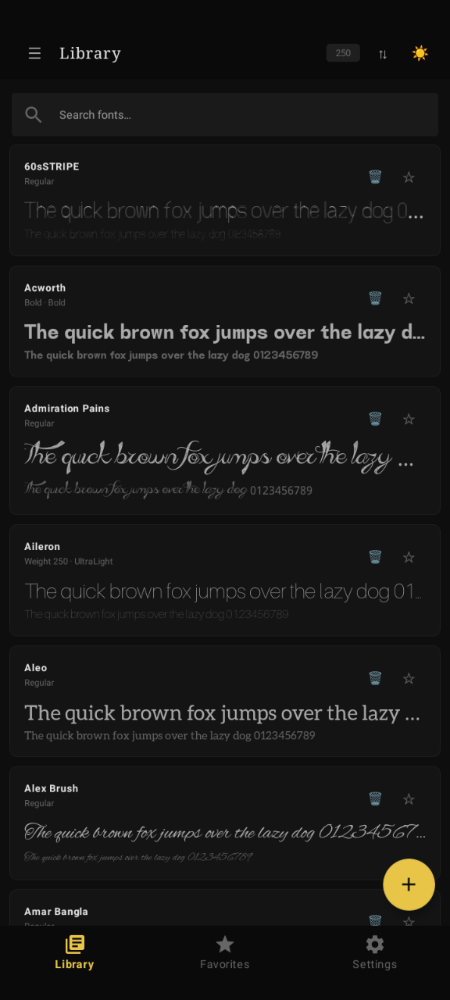
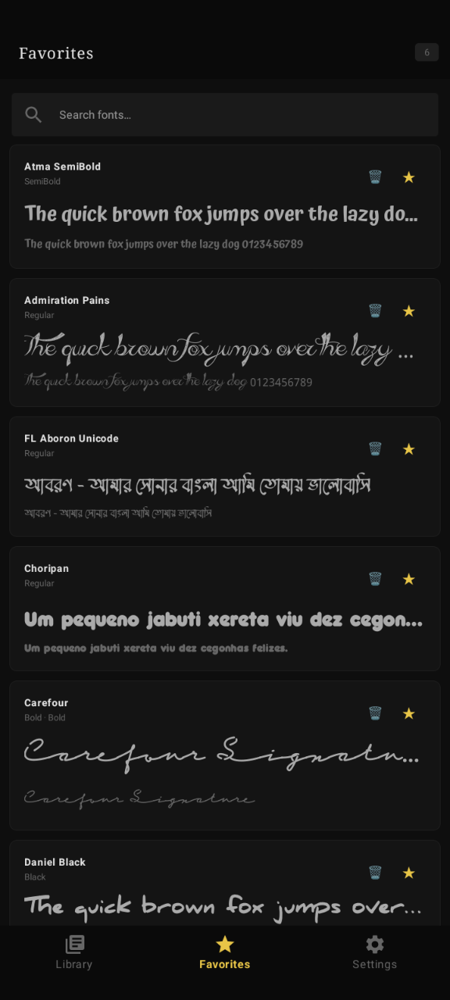
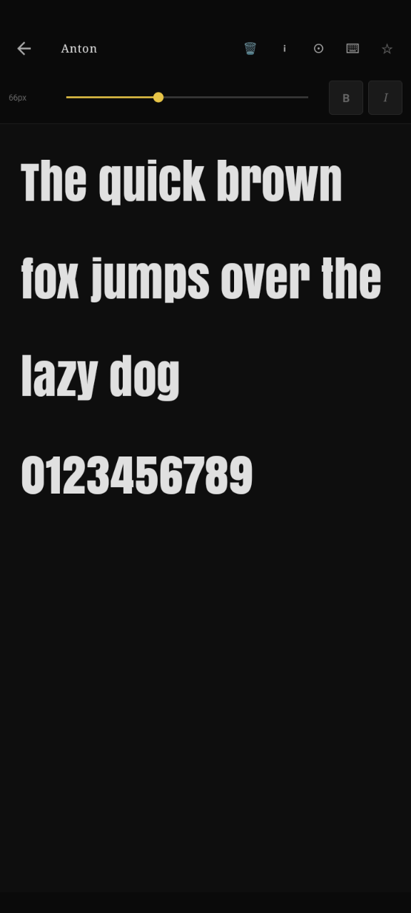
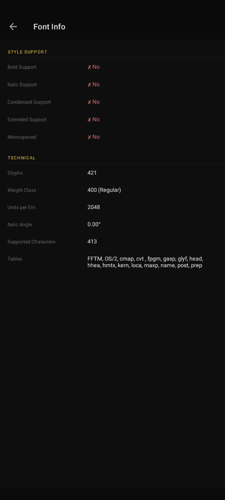
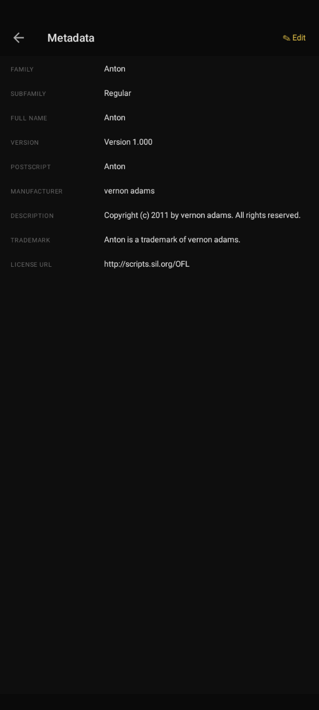
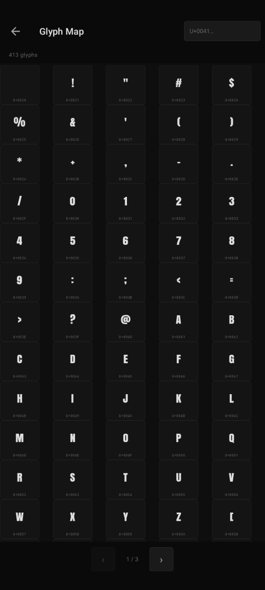

</img>
<p align="center">
<h1><b>FontLens</b></h1>
</p>

<p align="center">A fully offline Android font viewer and inspector</p>

## Features
- Completely offline. No permission required.
- Browse & preview local font files (.ttf, .otf, .woff, .woff2)
- Live editable font preview with size, bold, italic controls
- Glyph keyboard for showing all characters in the font
- Metadata viewer and editor
- Favorites system
- Multiple sample texts suppor with configurable priority

## Screenshots

<div></img>
</img>
</img></div>
<div></img>
</img>
</img></div>

## Building

### In Android Studio
1. Open the `FontLens/` folder
2. Wait for Gradle sync
3. Run ▶ on a device or emulator (min SDK 26)

### Via GitHub Actions
Push to `main` or `master` — the workflow builds a debug APK automatically.
Download it from the **Actions** tab → latest run → **Artifacts**.

### First-time Gradle wrapper setup
If `gradle/wrapper/gradle-wrapper.jar` is missing, run once locally:
```bash
gradle wrapper --gradle-version 8.4
```
This generates the `gradlew` binary and `.jar` needed by CI.

## Project Structure
```
app/src/main/
├── AndroidManifest.xml
├── java/com/fontlens/
│    ├── FontPreviewActivity.kt
│    ├── MainActivity.kt
│    ├── data/
│    │   ├── FontData.kt
│    │   └── FontRepository.kt
│    ├── ui/
│    │   ├── DeleteFontDialog.kt
│    │   ├── LoadingDialog.kt
│    │   ├── glyph/
│    │   │   ├── GlyphAdapter.kt
│    │   │   └── GlyphFragment.kt
│    │   ├── info/
│    │   │   └── FontInfoFragment.kt
│    │   ├── list/
│    │   │   ├── FavoritesFragment.kt
│    │   │   ├── FontListAdapter.kt
│    │   │   └── FontListFragment.kt
│    │   ├── meta/
│    │   │   ├── MetaAdapter.kt
│    │   │   ├── MetaEditFragment.kt
│    │   │   └── MetaFragment.kt
│    │   ├── preview/
│    │   │   ├── PreviewFragment.kt
│    │   │   ├── StandaloneGlyphFragment.kt
│    │   │   ├── StandaloneInfoFragment.kt
│    │   │   ├── StandaloneMetaFragment.kt
│    │   │   └── StandalonePreviewFragment.kt
│    │   └── settings/
│    │       └── SettingsFragment.kt
│    └── utils/
│        ├── FontLoader.kt
│        └── FontParser.kt
└── res/
    ├── color/
    │   ├── nav_item_color.xml
    │   └── switch_track_color.xml
    ├── drawable/
    │   ├── bg_accent_btn.xml
    │   ├── bg_badge.xml
    │   ├── bg_bottom_sheet.xml
    │   ├── bg_delete_btn.xml
    │   ├── bg_drawer_item.xml
    │   ├── bg_glyph_cell.xml
    │   ├── bg_input.xml
    │   ├── bg_loading_dialog.xml
    │   ├── bg_search_small.xml
    │   ├── bg_sheet_handle.xml
    │   ├── bg_spinner.xml
    │   ├── bg_style_btn.xml
    │   ├── bg_style_btn_active.xml
    │   ├── ic_add.xml
    │   ├── ic_back.xml
    │   ├── ic_launcher_foreground.png
    │   ├── ic_library.xml
    │   ├── ic_search.xml
    │   ├── ic_settings.xml
    │   └── ic_star.xml
    ├── layout/
    │   ├── activity_font_preview.xml
    │   ├── activity_main.xml
    │   ├── bottom_sheet_sort.xml
    │   ├── dialog_add_lang.xml
    │   ├── dialog_delete_font.xml
    │   ├── dialog_loading.xml
    │   ├── fragment_font_info.xml
    │   ├── fragment_font_list.xml
    │   ├── fragment_glyph.xml
    │   ├── fragment_meta_edit.xml
    │   ├── fragment_metadata.xml
    │   ├── fragment_preview.xml
    │   ├── fragment_settings.xml
    │   ├── item_drawer_folder.xml
    │   ├── item_edit_field.xml
    │   ├── item_folder_header.xml
    │   ├── item_font_card.xml
    │   ├── item_glyph_cell.xml
    │   ├── item_info_row.xml
    │   ├── item_lang_setting.xml
    │   └── item_meta_row.xml
    ├── menu/
    │   └── bottom_nav_menu.xml
    ├── mipmap-anydpi-v26/
    │   ├── ic_launcher.xml
    │   └── ic_launcher_round.xml
    ├── navigation/
    │   └── nav_graph.xml
    ├── values
    │   ├── colors.xml
    │   ├── dimens.xml
    │   ├── strings.xml
    │   └── themes.xml
    └── values-night
         └── themes.xml
```
## Disclaimer
This app is made by/with help of
- Claude AI [For coding help]
- Termux (Androied) [For git push]
- Github-Action [To build]

No Laptop/Computer is used.

## Copyright
```
Copyright (C) 2026 Md. Rasel Molla

This program is free software: you can redistribute it and/or modify it under the terms of the GNU General Public License as published by the Free Software Foundation, either version 3 of the License, or any later version.

This program is distributed in the hope that it will be useful, but WITHOUT ANY WARRANTY; without even the implied warranty of MERCHANTABILITY or FITNESS FOR A PARTICULAR PURPOSE.
See the GNU General Public License for more details.
```