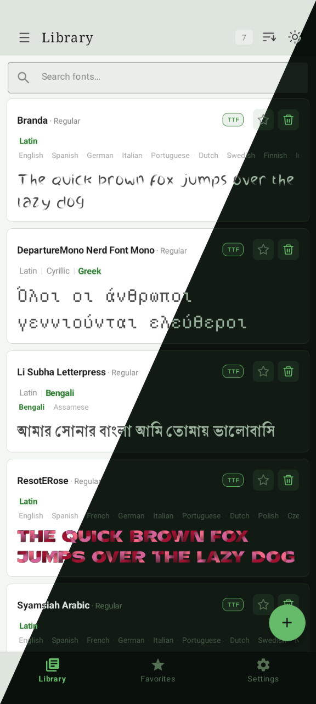
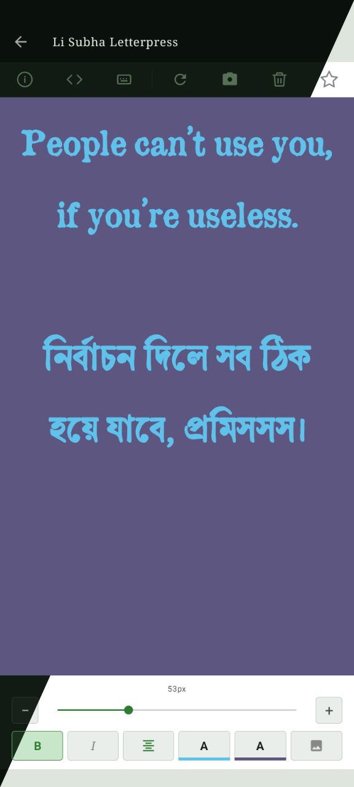
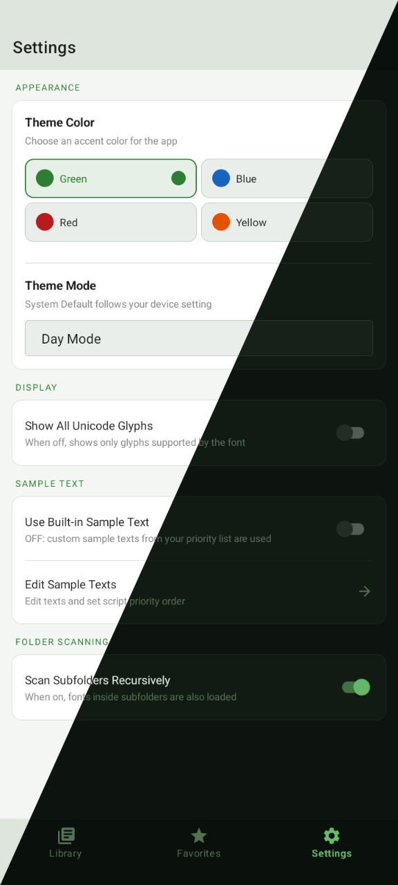
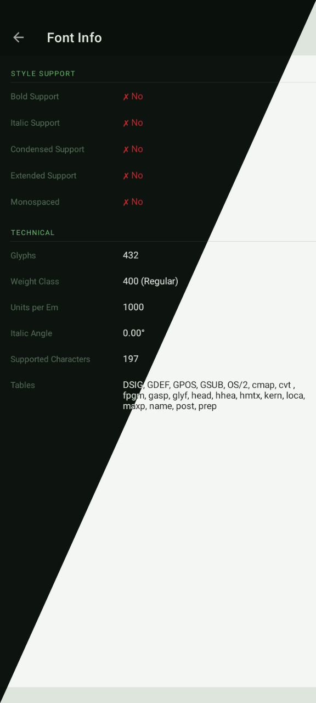
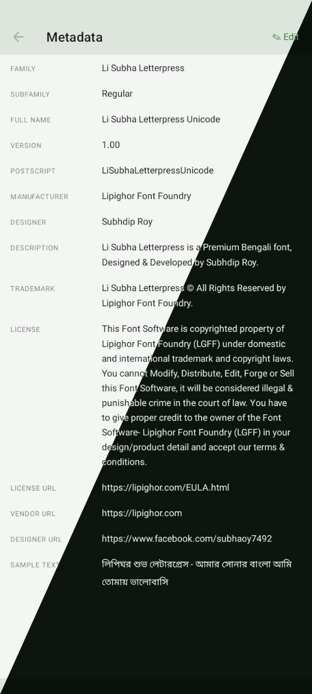
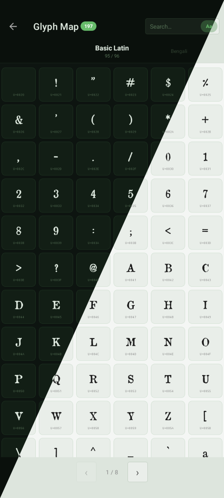

</img>

<h1 align="center">  <b>FontLens</b></h1>

A fully offline Android font viewer and inspector app

## Features
- Completely offline. No permission required.
- Browse & preview local font files (.ttf, .otf)
- Live editable font preview with size, bold, italic controls
- Glyph keyboard for showing all characters in the font
- Metadata viewer and editor
- Favorites system
- Multiple sample texts support with configurable priority

## Screenshots

</img>
</img>
</img>

</img>
</img>
</img>

## Building

### In Android Studio
1. Open the `FontLens/` folder
2. Wait for Gradle sync
3. Run ▶ on a device or emulator (min SDK 26)

### Via GitHub Actions
Push to `main` — the workflow builds a APK automatically.
Download it from the **Actions** tab → latest run → **Artifacts**.

## Development
This app is developed with the help of
- Claude AI — Coding assistance
- Termux (Android) — Version control and development
- GitHub Actions — Automated builds

No laptop or desktop computer was used in the development of this project.

## Copyright
Copyright (C) 2026 Md. Rasel Molla

FontLens is free software licensed under the [GNU General Public License (GPL)](LICENSE).